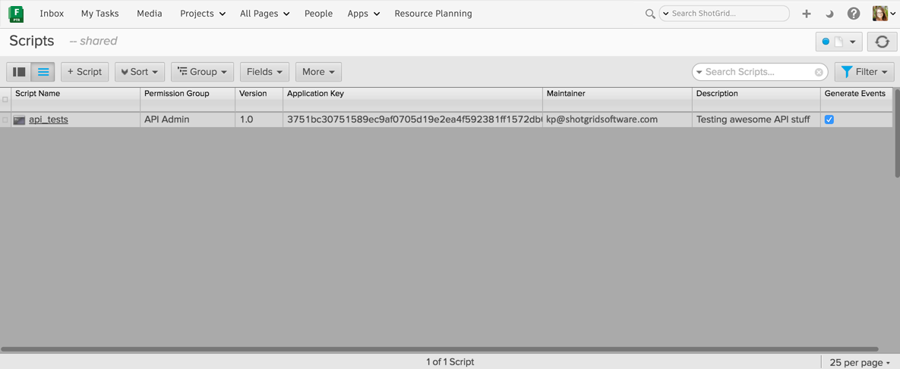

##############
Authentication
##############

In order to communicate with your server via the API, you must provide valid authentication credentials. The API allows you to authenticate with user-based, or script-based credentials.

*************************
User-based Authentication
*************************
When authenticating as a user, you provide your normal login and password when instantiating your :class:`shotgun_api3.Shotgun` object. The actions performed by this instance will be limited to your permission level just as they are in the  web application. ::

    sg = shotgun_api3.Shotgun("https://my-site.shotgrid.autodesk.com",
                              login="rhendriks",
                              password="c0mPre$Hi0n")

***************************
Script-based Authentication
***************************
In order to authenticate as a script, your script must be :ref:`registered with Flow Production Tracking and have a valid API key <setting_up_shotgrid>`. When creating your :class:`shotgun_api3.Shotgun` object, provide the ``script_name`` and ``api_key``.::

    sg = shotgun_api3.Shotgun("https://my-site.shotgrid.autodesk.com",
                              script_name="compress",
                              api_key="0123456789abcdef0123456789abcdef0123456789abcdef0123456789abcdef")

.. note:: When using script-based authentication, we **strongly** recommend you register each script separately with Flow Production Tracking and have individual API keys for each. This allows you to track down each of your scripts and the actions they are performing much more accurately in the event logs.

.. _setting_up_shotgrid:

Adding Script Users
===================
If you'll be using script-based authentication, you need to create a Script entity in Flow Production Tracking. To create a new key, click the + button on the "Scripts" page in the Admin section and give your script a useful name. It's a good idea to add any other relevant information that be be helpful to your other friendly Flow Production Tracking users such as a description of what the script does that is using this key, the email address of the maintainer, etc.:

Once you save your new Script entity, Flow Production Tracking will automatically generate an application key which will act as the script's password. The key will look something like this: ``0123456789abcdef0123456789abcdef0123456789abcdef0123456789abcdef``.

Why have different application keys for different scripts?
==========================================================
We recommend you create a new Script entity (and application key) for each script that is using script-based authentication so you can accurately log what scripts are doing what in case one of them causes problems. This will also allow you to better see what scripts are performing what actions in the EventLog. We've found that even though you may *think* you'll probably never need to know, the extra 2 minutes of setup now can prevent hours of headache in the future.

Event Logging
=============
By default, events generated by scripts using an script-based authentication are logged in Flow Production Tracking's event log. You can turn this off by un-checking the "Generate Events" checkbox either in the script detail page or from the main Scripts admin page in Flow Production Tracking.

.. note:: Turning off event logging will also prevent any email notifications from being triggered by your scripts since the email notifier relies on the event log to find events to notify for.

Scripts using user-based authentication will generate events similarly to if you were performing the same actions in the Flow Production Tracking web application, though there is some additional metadata stored in the ``EventLogEntry`` that identifies the event as created from a script acting on behalf of the user.

Why would you want to turn event logging off for scripts?
---------------------------------------------------------
It is an optimization that is not used often, but some users have integration scripts that are pushing data into Flow Production Tracking just for reference, like publishes from their asset management system. This publish data is never changed later, so the data itself has the entire history, and the events would just clutter the event log. The event log can grow very large. So if you have no need to audit the history of what your script does, and it's generating an large amount of event log entries, you may find it's not necessary to create these events.

***********
Permissions
***********
Users and scripts are both bound by the restrictions of their permission role in Flow Production Tracking. The permission role is assigned by the **Permission Role** field for each entity type.

For Scripts, the default permission role is "API Admin User" which allows full access to create, update, and delete entities and fields, including editing the "date created" audit field and creating event log entries. If you have other permission roles for ApiUsers, you can set the default role that will be assigned when a new script is created, in your Flow Production Tracking site preferences.

When using user-based authentication in your script, it will be bound by the permission role assigned to you in Flow Production Tracking. For example, if you don't have access to edit the status field on Shots, your script won't be able to either. Attempting to perform actions that are prohibited by permissions will raise an appropriate exception.

.. seealso:: `Permissions Documentation <https://help.autodesk.com/view/SGSUB/ENU/?guid=SG_Administrator_ar_site_configuration_ar_permissions_html>`_
